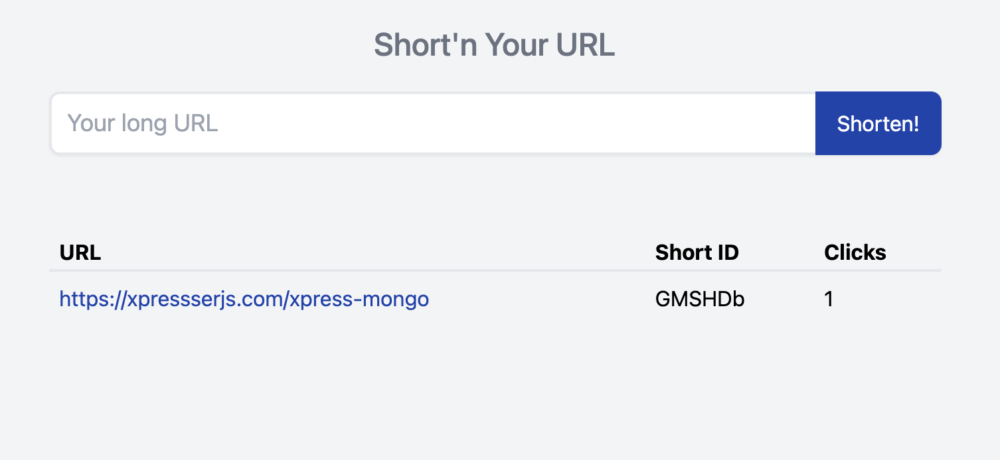

## Create Project

Create a new xpresserjs project using the `xjs-cli` Command line tool

```sh
npx xjs-cli new url-shortner
```

When asked for Language and Boilerplate select **Javascript & Simple App** Boilerplate

```shell
Project Language: Javascript
Project Boilerplate: Simple App (Hello World, No views)
```

`cd` into the new project folder and run `yarn` or `npm install` to install dependencies.

## Database

This tutorial will make use of **MongoDB** using **xpress-mongo** a lightweight ODM for Nodejs MongoDB.
<br>Note: We assume you are already familiar with the MongoDB Ecosystem.

### Setup Database Connection

For quick database setup we will use xpresser's **official xpress-mongo
plugin**: [@xpresser/xpress-mongo](https://www.npmjs.com/package/@xpresser/xpress-mongo). Following the installation
instructions in the plugin's repository, we need to install `xpresser-mongo` and `@xpress-mongo/xpress-mongo`

- **[xpresser-mongo](https://www.npmjs.com/package/xpress-mongo)** - A lightweight ODM for Nodejs MongoDB.
- **[@xpresser/xpress-mongo](https://www.npmjs.com/package/@xpresser/xpress-mongo)** - Xpresser's Plugin that connects
  to MongoDB using xpress-mongo and provides the Connection pool throughout your application's lifecycle.

```shell
npm i xpress-mongo @xpresser/xpress-mongo
# OR
yarn add xpress-mongo @xpresser/xpress-mongo
```

Create a **plugins.json** file in your **backend** folder. i.e. `backend/plugins.json` and paste the json below.

```json
{
  "npm://@xpresser/xpress-mongo": true
}
```

## Configure

Let's add/modify our apps configuration. Goto File: **config.js**

#### Change Name

- Change project **name** from `Xpresser-Simple-App` to `Url Shortener` or any custom name you prefer.
- Add the database config below to your config file.

```javascript
module.exports = {
  // .... After every other config.
  mongodb: {
    url: 'mongodb://127.0.0.1:27017',
    database: 'url-shortener',
    options: {
      useNewUrlParser: true,
      useUnifiedTopology: true
    }
  }
}
```

## Frontend

Let's make an index view. (xpresser supports Ejs by default)

Note: Since we now have xjs-cli in our project, we can use the command `xjs` without npx in our project root

```shell
xjs make:view index
```

this will create a .ejs file @ `backend/views/index.ejs`. Paste the code below in it.

```html
<!DOCTYPE html>
<html lang="en">
<head>
  <meta charset="UTF-8">
  <meta http-equiv="X-UA-Compatible" content="IE=edge">
  <meta name="viewport" content="width=device-width, initial-scale=1.0">
  <link href="https://unpkg.com/tailwindcss@^2/dist/tailwind.min.css" rel="stylesheet">
  <title>Xpresser URL Shortener</title>
</head>
<body class="bg-gray-100">
<main class="max-w-2xl mx-auto mt-5">
  <h2 class="text-2xl font-medium text-center text-gray-500">Short'n Your URL</h2>

  <!-- Input Form -->
  <form method="post" action="/shorten" class="my-5 flex">
    <div class="flex-auto">
      <input type="url" name="url" placeholder="Your long URL" required
             class="w-full border-l-2 border-t-2 border-b-2 py-2 px-3 text-lg text-blue-800 rounded-l shadow-sm focus:outline-none">
    </div>

    <div class="flex-initial">
      <button class="py-3 px-3 text-md bg-blue-800 text-white rounded-r shadow-sm focus:outline-none">
        Shorten!
      </button>
    </div>
  </form>

  <!-- Url Table-->
  <div class="overflow-x-auto">
    <table class="mt-10 w-full">
      <thead class="border-b-2 mb-3">
      <tr class="text-ble-800 text-left">
        <th class="px-2">URL</th>
        <th class="px-2">Short ID</th>
        <th class="px-2">Clicks</th>
      </tr>
      </thead>
      <tbody class="mt-3">
      <tr>
        <td class="p-2">
          <a href="https://xpressserjs.com/xpress-mongo" class="text-blue-800">
            https://xpressserjs.com/xpress-mongo</a>
        </td>
        <td class="p-2">GMSHDb</td>
        <td class="p-2">1</td>
      </tr>
      </tbody>
    </table>
  </div>
</main>
</body>
</html>
```

## Control Requests

Empty file: `backend/controllers/AppController.js` and paste the content below.

```javascript
module.exports = {
  
  name: 'AppController',
  
  /**
   * Index Page Action.
   * For route "/"
   */
  index(http) {
    return http.view('index');
  },
};
```

### Preview

Run `node app.js` to preview the html in `index.ejs`



## Making it work

Let's make this work with real values from the database.

### Create Url Model

To create a model

```shell
xjs make:model Url
```

Creates a model @ `backend/models/Url.js`.

### Adding Database Schema

In your new model you will see default fields: `updatedAt` & `createdAt`. we need to add other fields like `url`
, `shortId` & `clicks` like so

Note: The `updatedAt` field is not needed.

```js
schema = {
  url: is.String().required(),
  shortId: is.String().required(),
  clicks: is.Number().required(),
  createdAt: is.Date().required()
};
```

Your model file should look exactly like

```javascript
const {is} = require('xpress-mongo');
const {DBCollection, is} = require('@xpresser/xpress-mongo');

/**
 * Url Model Class
 */
class Url extends DBCollection('urls') {
  
  // Set Model Schema
  static schema = {
    url: is.String().required(),
    shortId: is.String().required(),
    clicks: is.Number().required(),
    createdAt: is.Date().required(),
  };

}

module.exports = Url;
```

## Add Url

In our **index.ejs** file, the url `form` is sent via POST method to action: `/shorten`

Let's register path `/shorten` in the **routes.js** file.

Add this line to the end your routes file.

```javascript
router.post('/shorten', 'App@shorten');
```

This simply means that we want the `shorten` method in `AppController` to handle the POST request to `/shorten`

## Add shorten method

Let's add shorten method to AppController where we will process all data and redirect.

```javascript
module.exports = {
  // .... Other Methods ....
  async shorten(http) {
    // Get url from request body.
    const url = http.body("url");
    // Generate short url using xpresser's randomStr helper.
    const shortId = http.$("helpers").randomStr(6)
    
    try {
      console.log(
          await Url.new({url, shortId})
      )
    } catch (e) {
      console.log(e)
    }
    
    return http.redirectBack()
  }
}
```

- First, Get the `url` sent by the frontend form.
- Generate short url using xpresser's `randomStr` helper.
- Try adding a new document to the database. Logs error or new url document.
- Redirect back to sender i.e. frontend.

#### Let's test the progress so far.

Run: `node app.js`, Then shorten a long url.

A look alike of the log below should show in your log after the request redirects back if successful.

```
Url {
  data: {
    _id: 60c357723f80e72678b72ba7,
    url: 'https://xpresserjs.com/xpress-mongo/events',
    shortId: 'AyXvu',
    clicks: 0,
    createdAt: 2021-06-11T12:30:42.064Z
  }
}
```

The data above is saved to your database but our `index.ejs` does not show it yet. Now let's make our `index.ejs` use
dynamic values from the database.

Remember our `index.ejs` is rendered by the `AppController@index` controller route action. So that is where we will get
list of urls from the database and provide it to `index.ejs`

Modify the `index` method in `AppController` to look like so:

```js
module.exports = {
  
  async index(http) {
    // Get all urls from db.
    const urls = await Url.find();
    
    // Share urls with index.ejs
    return http.view("index", {urls});
  },

}
```

Next lets modify `index.ejs` file to use the `urls` data provided. Change this section of your `index.ejs` file

##### FROM

```ejs
<!-- Url Table-->
<div class="overflow-x-auto">
  <table class="mt-10 w-full">
    <thead class="border-b-2 mb-3">
    <tr class="text-ble-800 text-left">
      <th class="px-2">URL</th>
      <th class="px-2">Short ID</th>
      <th class="px-2">Clicks</th>
    </tr>
    </thead>
    <tbody class="mt-3">
    <tr>
      <td class="p-2">
        <a href="https://xpressserjs.com/xpress-mongo" class="text-blue-800">
          https://xpressserjs.com/xpress-mongo</a>
      </td>
      <td class="p-2">GMSHDb</td>
      <td class="p-2">1</td>
    </tr>
    </tbody>
  </table>
</div>
```


